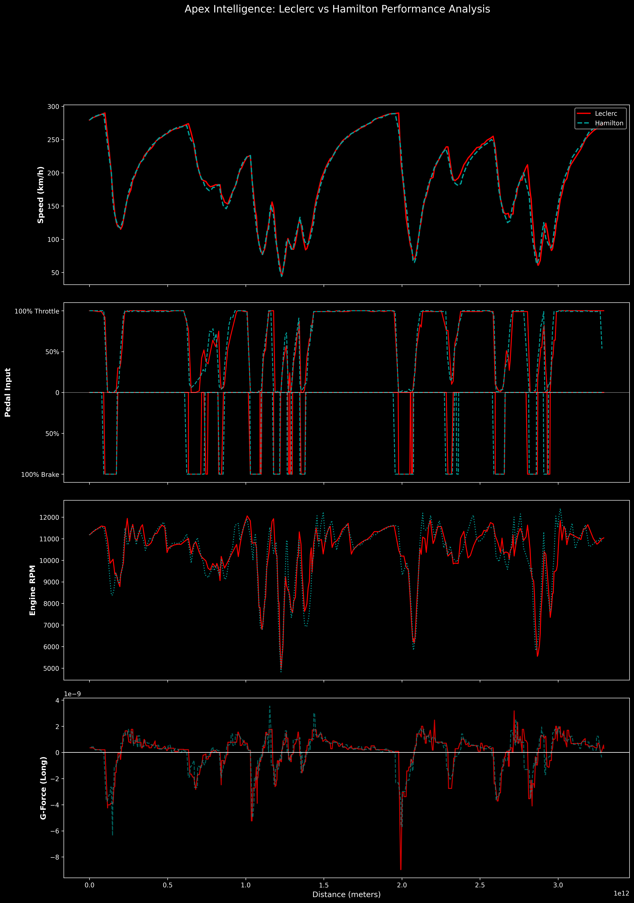

# Apex Intelligence: F1 Telemetry Analysis Pipeline 🏎️

An advanced data engineering project utilizing **Python**, **FastF1**, and **SQLite** to extract, process, and visualize Formula 1 sensor data. This project focuses on comparing driver performance through high-frequency telemetry.

## 📊 Visual Analysis

### 1. Circuit Performance Heatmap
This visualization maps car velocity directly onto GPS coordinates. It allows for immediate identification of high-speed aerodynamic zones (Green) versus low-speed mechanical grip sections (Red).

* **Technical Insight:** Notice the "Deep Red" at the Fairmont Hairpin, transitioning into "Dark Green" through the Tunnel, illustrating the extreme velocity delta in Monaco.

### 2. Linear Speed Profile
A distance-based comparison of velocity, providing a "heartbeat" of the lap.

* **Technical Insight:** By plotting against **Distance** rather than Time, we can precisely overlay different laps to find exactly where one driver gains an advantage.

---

## 🛠️ Tech Stack & Engineering Focus
* **Data Acquisition:** FastF1 API integration with local caching for high-speed retrieval.
* **Data Processing:** `Pandas` and `NumPy` for calculating derivative metrics like **Longitudinal G-Force**.
* **Storage:** `SQLite` for structured telemetry management.
* **Visualization:** `Matplotlib` using `LineCollection` for multi-dimensional spatial plots.

## 🚀 How to Run the Dashboard
1. Clone the repository.
2. Install dependencies:  
   `pip install -r requirements.txt`
3. Launch the Command Center:  
   `streamlit run app.py`

---
*Note: This project is currently in the **Sprint Phase**. Upcoming features include AI-powered strategy agents and 2026 Regulation RAG integration.*